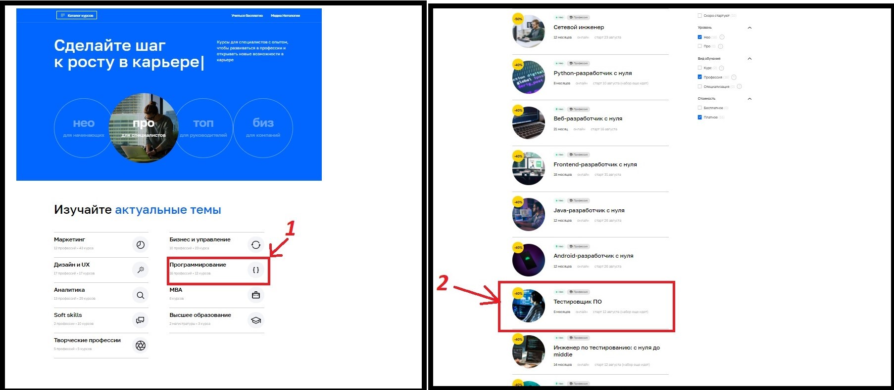

### ПЛАН АВТОМАТИЗАЦИИ ТЕСТИРОВАНИЯ

##### ОБЪЕКТ ТЕСТИРОВАНИЯ: *переход к форме записи на обучение профессии "Тестировщик ПО" и заполнения этой формы на сайте netology.ru (далее - "Сайт")*
##### ПЕРЕЧЕНЬ АВТОМАТИЗИРУЕМЫХ СЦЕНАРИЕВ:

1.Тестируемая форма для записи на обучение профессии "Тестировщик" находится на странице https://netology.ru/programs/qa (далее - "Страница"), попасть на которую можно используя указанные ниже пути :

*1. Путь "Каталог курсов"*

 Переход с главной страницы Сайта в меню  "Каталог курсов" -> меню "Программирование" -> вкладка "Тестировщик ПО" (доступна выборка по фильтрам) 
 

*2. Путь "НЕО"*

Переход с главной страницы Сайта в меню  "НЕО для начинающих" -> меню "Программирование" -> вкладка "Тестировщик ПО" (доступна выборка по фильтрам) 
 
 
*3. Путь "Актуальные темы"*

Переход с главной страницы Сайта в меню "Программирование" расположенное в блоке "Изучайте актуальные темы" -> вкладка "Тестировщик ПО" (доступна выборка по фильтрам) 
 
 
 *4. Путь "Шаги"*
 
Нажать на кнопку "Выбрать курс", расположенную на главной странице в блоке "Раскройте свои сильные стороны" -> вкладка "Тестировщик ПО" (доступна выборка по фильтрам) 
  
  
*5. Путь "Полный каталог курсов"*
  
Переход с главной страницы Сайта в меню  "Каталог курсов" -> кнопка "Полный каталог курсов" -> вкладка "Тестировщик ПО" (доступна выборка по фильтрам) 
   
   
*6. Путь "Финальный блок"*
  
Выбрать меню "Программирование" в самом нижнем блоке страницы  -> вкладка "Тестировщик ПО" (доступна выборка по фильтрам)
   

**Для тестирования путей к Странице необходимо 6 автотестов**

2. Доступ к форме для записи на Странице возможен путем нажатия кнопки "Записаться", которая расположена в трех местах:
   
   
 **Для тестирования кликабельности кнопки "Записаться" на Странице необходимо 3 автотеста**
   
3. Форма для записи содержит поля **"Имя"** и **"Номер телефона"**
Учитывая необходимость проверки как позитивных, так и негативных сценариев предлагается следующий перечень тестов данной формы:

*Позитивные тесты отправки формы:*
1. валидный телефон и минимально короткое имя, например "Ян"
2. валидный телефон и сложное имя через дефис, например "Анна-Мария"
3. валидный телефон и стандартное имя, например "Александр"
4. валидный телефон и сложное имя через пробел, например "Олег Иванов"
5. валидный телефон и имя, перед которым несколько пробелов
6. валидный телефон и имя, в котором есть буква ё

*Негативные тесты отправки формы:*
1. с пустыми полями Имя и Телефон
2. с валидным именем но пустым полем телефона
3. с валидным телефоном но пустым полем имени
4. с валидным именем но невалидным телефоном (цифр в номере меньше установленного)
5. с валидным именем но невалидным телефоном (цифр в номере больше установленного)
6. с валидным именем но невалидным телефоном (буквы вместо цифр)
7. с валидным именем но невалидным телефоном (все цифры в номере нули)
8. с валидным  именем но невалидным телефоном(в поле "телефон" пробел)
9. с валидным именем, но невалидным именем (сочетание цифр и символов в номере)
10. с валидным телефоном но невалидным именем (имя написано латиницей)
11. с валидным телефоном но невалидным именем (имя написано цифрами)
12. с валидным телефоном но невалидным именем (имя содержит недопустимые символы)
13. с валидным телефоном но невалидным именем (имя превышает допустимое количество символов)
14. с валидным телефоном но невалидным именем (пробел в поле "Имя")

#### ИТОГО план автоматизации тестирования включает **3 блока тестирования и 29 автотестов**

##### ПЕРЕЧЕНЬ ИСПОЛЬЗУЕМЫХ ИНСТРУМЕНТОВ С ОБОСНОВАНИЕМ ВЫБОРА

Для тестирования понадобятся следующие инструменты:

***IntelliJ IDEA*** – среда разработки программного обеспечения для написания кода проекта.

***Java, версия 11*** – язык программирования проекта.

***Git*** - система контроля версий, позволяет фиксировать изменения в коде, быстро "откатить" изменения назад, сохранять предыдущие версии.

***Gradle*** либо ***Maven*** — системы автоматической сборки.

***JUnit-5*** - один из самых популярных фреймфорков для модульного тестирования ПО.

***Selenide*** - фреймворк для автоматизированного тестирования веб-приложений.

***Lombok*** - плагин для автоматической генерации кода, позволяет сократить количество кода.

##### ПЕРЕЧЕНЬ НЕОБХОДИМЫХ РАЗРЕШЕНИЙ/ДАННЫХ/ДОСТУПОВ

1. Разрешение на тестирование от Нетологии
2. ТЗ, содержащее критерии валидности/невалидности данных для заполнения Формы для записи
3. Доступ к БД для проверки результатов отправки валидных/невалидных тестовых данных через Форму для записи

##### ПЕРЕЧЕНЬ И ОПИСАНИЕ ВОЗМОЖНЫХ РИСКОВ ПРИ АВТОМАТИЗАЦИИ

1. Тесты могут не покрывать всех возможных негативных сценариев - всегда есть возможность, что пользователь поведет себя так, как мы не можем предвидеть. Эти риски придется закрывать уже не этапе продакшна.
2. Тестовые данные могут попасть в реальную базу данных Нетологии. 
3. В случае изменения ПО сайта либо каких-либо из используемых инструментов тестирования может потребоваться модификация тестов.

##### ПЕРЕЧЕНЬ НЕОБХОДИМЫХ СПЕЦИАЛИСТОВ ДЛЯ АВТОМАТИЗАЦИИ

QA инженер с опытом автоматизации, умеющий работать с вышеперечисленными инструментами тестирования

##### ИНТЕРВАЛЬНАЯ ОЦЕНКА С УЧЕТОМ РИСКОВ (в часах)

С учтом необходимости оформления сопутствующей документации (тест-планы, баг-репорты, отчеты о тестировании), а также с поправкай на обстоятельства, которые могут повлиять на продолжительность тестирования (технические неисправности сервера, отсутствие необходимых разрешений, внесение изменений в инструментарий и тп.) **интервальная оценка составляет около 20 часов**.
